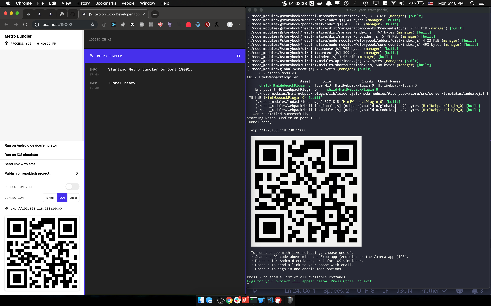
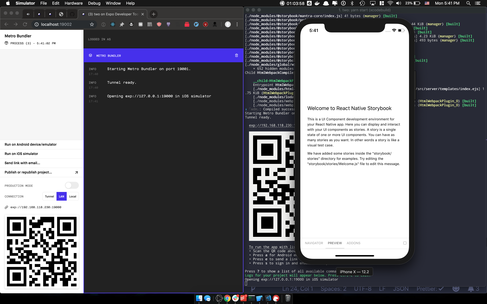
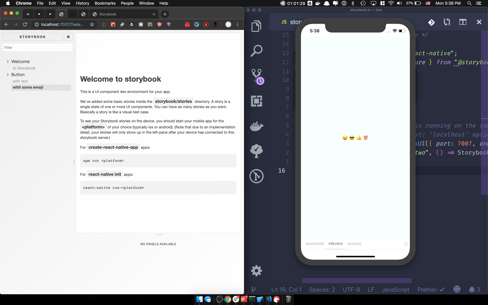

# React Native + Expo + Storybook v5

## Why

This project was inspired by this issue: https://github.com/storybooks/storybook/issues/6445

After initially settling for a half-fix,decided to double-down and figure it out.

Now, this is a 3/4ths fix.

The 100% solution will be when you can render all of this via React Native Web in browser (ie. making the simulator optional). Currently not possible from what I can tell.

## Getting Started

```bash
$ yarn install
$ > select @storybook/react-native version: 5.1.0-alpha.40"
$ yarn start
```

## What you should see

**yarn install**
> 5.1.0-alpha.40 is the latest version at the time of writing


**yarn start**


**run iOS Simulator**


**open http://localhost:7007 after simulator is open**


---

Also, I like to take notes. Here's my debug docs: [debug.pdf](./docs/debug.pdf)

---

If you're still having issues:

1. Try resetting Simulator (I'm using iOS for my tests, haven't tested Android at all) via Hardware -> Erase All Content and Settings
2. Try opening Simulator before loading the `@storybook/react-native-server`
