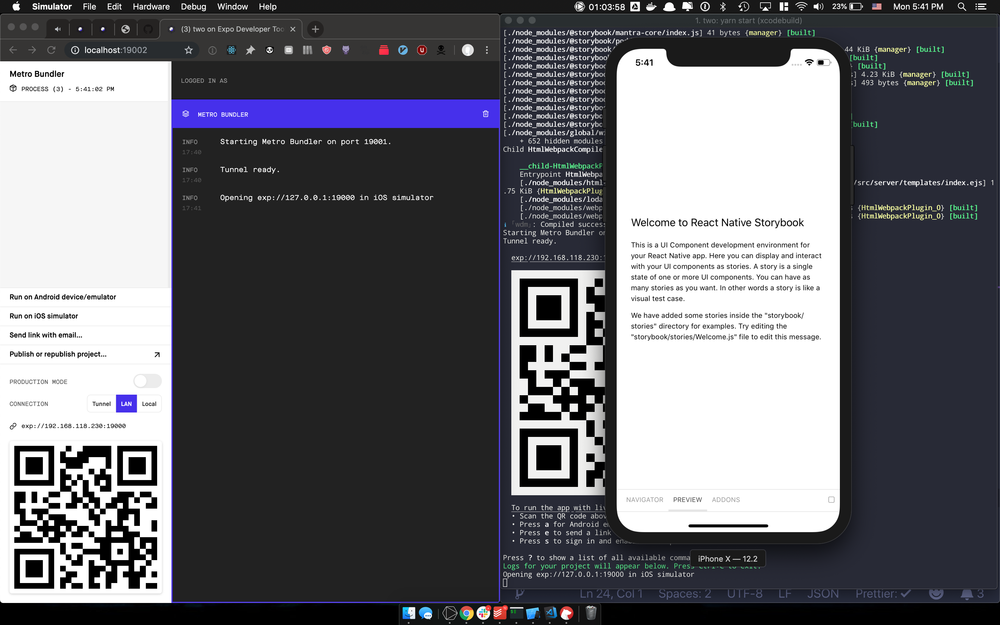
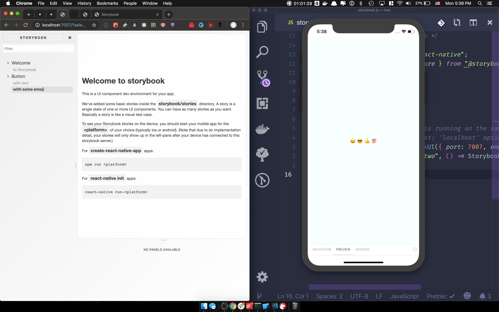

# React Native + Expo + Storybook v5

## Why

This project was inspired by this issue: https://github.com/storybooks/storybook/issues/6445

After initially settling for a half-fix,decided to double-down and figure it out.

Now, this is a 3/4ths fix.

The 100% solution will be when you can render all of this via React Native Web in browser (ie. making the simulator optional). Currently not possible from what I can tell.

## Getting Started

```
yarn install
yarn start
```

## What you should see

**Install**


**Expo**


**Storybook**


---

Also, I like to take notes. Here's my debug docs: [debug.pdf](./docs/debug.pdf)
