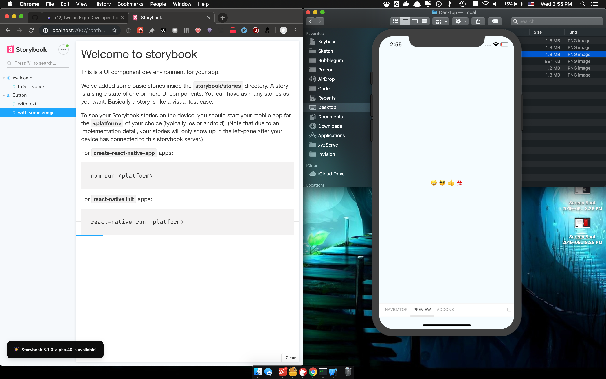
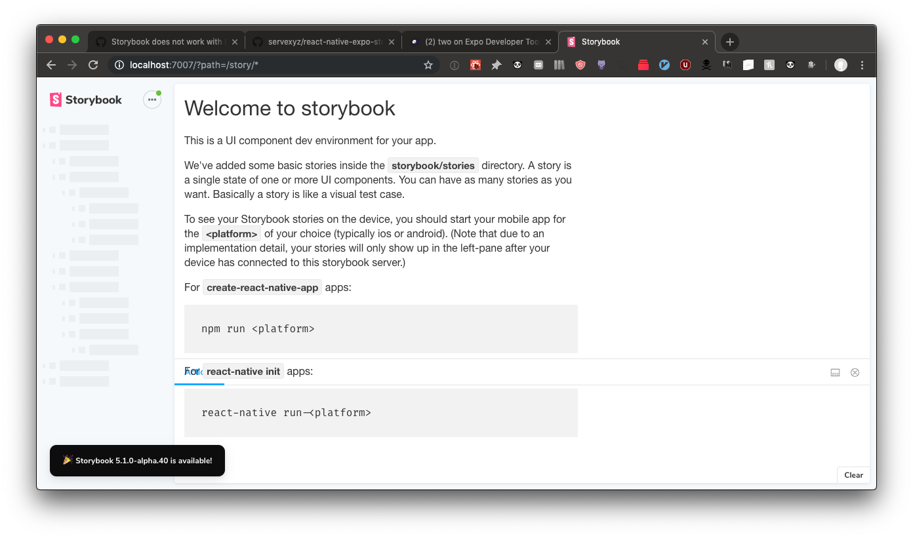

# React Native + Expo + Storybook v5

This repository was inspired by this issue: https://github.com/storybooks/storybook/issues/6445

## Getting Started

```bash
$ yarn install
$ > select @storybook/react-native version: 5.1.0-alpha.40
$ yarn start
```

## What you should see

**yarn install**
> 5.1.0-alpha.40 is the latest version at the time of writing


**yarn start**


**run iOS Simulator**


**open http://localhost:7007 after simulator is open**
> Visit thread to see more info about switching from 5.2 to 5.1:
> https://github.com/storybooks/storybook/issues/6445#issuecomment-490481700



---

Also, I like to take notes. Here's the debug docs from when I was having issues before:

| What                                                               | Description                                                                                                                                                                                                                 |
|--------------------------------------------------------------------|-----------------------------------------------------------------------------------------------------------------------------------------------------------------------------------------------------------------------------|
| [debug.pdf](debug.pdf)                                             | First attempt. Implemented 5.2.0-alpha.3 succesfully                                                                                                                                                                        |
| [Storybook_version_downgrade.pdf](Storybook_version_downgrade.pdf) | Second attempt. Found out that v5.2.0 was condemned. Migrated to v5.1.0-alpha.40. The solution to the issues found in this doc can be read here: https://github.com/storybooks/storybook/issues/6445#issuecomment-490660408 |

---

## Still having issues?

1. Try resetting Simulator (I'm using iOS for my tests, haven't tested Android at all) via `Hardware` -> `Erase All Content and Settings`
2. Try opening your simulator and then refreshing Storybook. You may notice that Stories spin indefinitely without loading if your simulator isn't loaded, like so:



---

## Afterthought

After initially settling for a half-fix,decided to double-down and figure it out.

This repo represents a 3/4ths fix. Technically works. It does connect the storybook server to the react native simulator.

The 100% solution will be when you can render all of this via React Native Web in browser (ie. making the simulator optional). Currently not possible from what I can tell.
